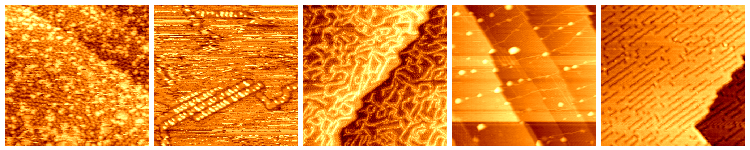

# Machine Learning techniques and visualization tools for STM images at CNR-IOM labs

###### Master's thesis of Data Science and Scientific Computing MSc MSc. @ UniTS/SISSA

## Abstract

One of the main challenges in scientific research is data management, especially in the long term. According to the European Commission data guidelines for the Horizon 2020 [1]:

> *Open scientific research data should be easily discoverable, accessible, assessable, intelligible, useable, and wherever possible interoperable to specific quality standards.*

A clear set of principles guiding this process has been published in the FAIR Guiding Principles, which aim to render scientific data 'FAIR', that is findable, accessible, interoperable and re-usable. [2]

The Istituto Officina dei Materiali' of the Italian National Research Council (CNR-IOM) data infrastructure hosts different services for the Nanoscience Foundries & Fine Analysis NFFA-Europe project, which brings together twenty European nanoscience research laboratories with the aim to provide open access to advanced instrumentation and theory. [3] [4]

This work shows the steps taken to  make FAIR a dataset of more than 100.000 scientific images obtained using Scanning Tunnelling Microscope (STM) techniques  in the TASC laboratory at CNR-IOM of Trieste in the last 20 years. [5]

## Repository structure
- `jupyter_notebooks/`, contains the notebooks used for different steps of the dataset analysis

- `Metadata DB/`, have all the code used to create the STM metadata database

- `TriDAS/`, comprehend all the files necessary to build and run the Trieste Advance Data Services website (TriDAS)

- `Thesis/`, files and images used in the writing of this thesis

- `utils/`, contains .py files with functions for the STM images analysis

## References
[1] European Commision, 2016 ["Guidelines on FAIR Data Management in Horizon 2020"](https://ec.europa.eu/research/participants/data/ref/h2020/grants_manual/hi/oa_pilot/h2020-hi-oa-data-mgt_en.pdf)

[2] Wilkinson et al. 2016, ["The FAIR Guiding Principles for scientific data management and stewardship"](https://www.nature.com/articles/sdata201618)

[3] Istituto Officina dei Materiali' of the Italian National Research Council, [CNR-IOM](https://www.iom.cnr.it/)

[4] Nanoscience Foundries & Fine Analysis NFFA-Europe project, [NFFA-Europe](https://www.nffa.eu/) 

[5] Trieste Advance Data Services, [TriDAS](https://tridas.nffa.eu/)
