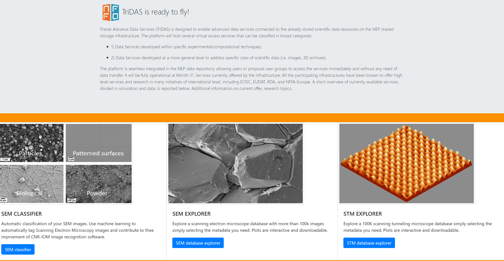

# TriDAS: Trieste Advance Data Services

[Trieste Advance Data Services(TriDAS)](https://tridas.nffa.eu/ "Trieste Advance Data Services(TriDAS)") aims to serve as a hub from which researchers can access several data services. These can be classified in two broad categories: 
- data services developed within specific experimental or computational techniques 

- data services developed to address specific class of scientific data, like images or 3D archives. 

An example of the first kind of services is the [Scanning Electron Microscopy (SEM) classifier](http://sem-classifier.nffa.eu/ "Scanning Electron Microscopy (SEM) classifier") that was already developed at CNR-IOM, which use machine learning to automatically tag SEM images.  

There are two services for specific scientific data:
 the [STM database explorer](https://tridas.nffa.eu/dashboard_stm/ "STM images") and the [SEM database explorer](https://tridas.nffa.eu/dashboard_sem/ "SEM images"), that let users analyze the images metadata visually, through interactive and downloadable plots.

TriDAS is built using [Flask](https://github.com/pallets/flask "Flask"), a Python web application framework. STM and SEM images plots are created using [Bokeh](https://github.com/bokeh/bokeh "Bokeh"), a Python interactive visualization library that targets modern web browsers for presentation.
